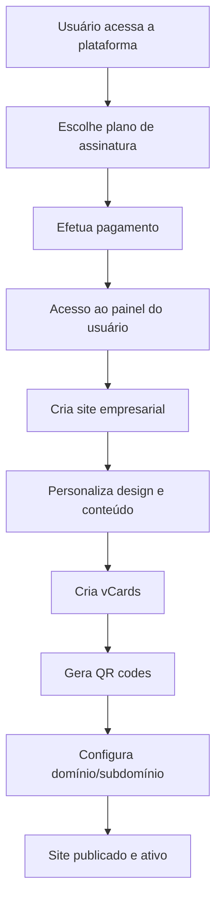

# 1. Introdução ao Sistema Businesso

## 🎯 O que é o Businesso?

O **Businesso** é uma plataforma completa de criação de sites empresariais que permite aos usuários criarem uma presença digital profissional de forma rápida e eficiente. É uma solução SAAS (Software as a Service) que oferece todas as ferramentas necessárias para construir, personalizar e gerenciar sites de negócios.

## 🌟 Principais Funcionalidades

### 1. **Criação de Sites Empresariais**
- Interface drag-and-drop intuitiva
- Templates profissionais pré-definidos
- Design responsivo para todos os dispositivos
- Suporte multilíngue (incluindo RTL - direita para esquerda)

### 2. **Sistema de vCards**
- Criação ilimitada de cartões de visita digitais
- Integração com redes sociais
- QR codes personalizados para cada vCard
- Compartilhamento fácil via link

### 3. **Builder de QR Codes Avançado**
- Criação de códigos QR personalizados
- Filtros e estilos diversos
- Integração com qualquer URL
- Tracking de acessos

### 4. **Sistema de Domínios Flexível**
- **Subdomínios automáticos**: `{seu-usuario}.dominio.com`
- **Domínios personalizados**: Use seu próprio domínio
- **URLs baseadas em caminho**: `dominio.com/{seu-usuario}`

### 5. **Sistema de Assinaturas**
- Planos mensais, anuais e vitalícios
- Recursos diferenciados por plano
- Pagamentos seguros com múltiplos gateways
- Gerenciamento automático de renovações

## 🏗️ Como Funciona a Plataforma

### Arquitetura Multitenancy
O Businesso utiliza uma arquitetura multitenancy, o que significa que:
- Cada usuário tem seu próprio espaço isolado
- Recursos são compartilhados de forma eficiente
- Escalabilidade automática conforme a demanda
- Segurança garantida entre diferentes usuários

### Fluxo de Uso Típico

## 💼 Casos de Uso Ideais

### Para Profissionais Autônomos
- Médicos, advogados, consultores
- Freelancers e prestadores de serviços
- Artistas e criadores de conteúdo

### Para Pequenas Empresas
- Lojas locais e comércio eletrônico
- Restaurantes e serviços de alimentação
- Salões de beleza e clínicas

### Para Organizadores de Eventos
- Eventos corporativos
- Casamentos e festas
- Conferências e workshops

## 🔧 Tecnologias Utilizadas

- **Backend**: Laravel 9 (PHP 8.2)
- **Frontend**: HTML5, CSS3, JavaScript
- **Banco de Dados**: MySQL
- **Pagamentos**: 19+ gateways integrados
- **Multilíngue**: Suporte completo a i18n

## 🎨 Recursos de Design

### Templates Responsivos
- Design moderno e profissional
- Adaptação automática a dispositivos móveis
- Paleta de cores personalizável
- Tipografia otimizada para leitura

### Personalização Avançada
- Editor visual drag-and-drop
- Upload de imagens e logos
- Configuração de cores e fontes
- Layouts flexíveis e modulares

## 🌍 Suporte Internacional

### Idiomas Suportados
- Português (Brasil)
- Inglês
- Espanhol
- Francês
- Alemão
- E muitos outros...

### Suporte RTL
- Compatível com idiomas da direita para esquerda
- Árabe, hebraico, persa, etc.
- Interface totalmente adaptada

## 🚀 Vantagens da Plataforma

### Para Usuários Finais
- ✅ **Simplicidade**: Interface intuitiva, sem necessidade de conhecimento técnico
- ✅ **Rapidez**: Site publicado em minutos
- ✅ **Profissionalismo**: Design moderno e responsivo
- ✅ **Flexibilidade**: Múltiplas opções de personalização
- ✅ **Suporte**: Assistência técnica completa

### Para Administradores
- ✅ **Escalabilidade**: Suporte a milhares de usuários
- ✅ **Monetização**: Sistema de assinaturas integrado
- ✅ **Gestão**: Painel administrativo completo
- ✅ **Analytics**: Relatórios detalhados de uso

## 📱 Acesso Multiplataforma

O Businesso funciona perfeitamente em:
- 💻 **Desktop**: Windows, macOS, Linux
- 📱 **Mobile**: iOS, Android
- 🌐 **Navegadores**: Chrome, Firefox, Safari, Edge
- 📟 **Tablets**: iPad, Android tablets

---

## ➡️ Próximo Passo

Agora que você conhece o sistema Businesso, vamos aprender como fazer seu primeiro acesso e configurar sua conta.

**Continue para:** [Primeiro Acesso →](02-primeiro-acesso.md)

---

*💡 **Dica**: Mantenha este tutorial sempre à mão durante seus primeiros usos da plataforma. Ele será seu guia completo para aproveitar ao máximo todas as funcionalidades do Businesso.*
